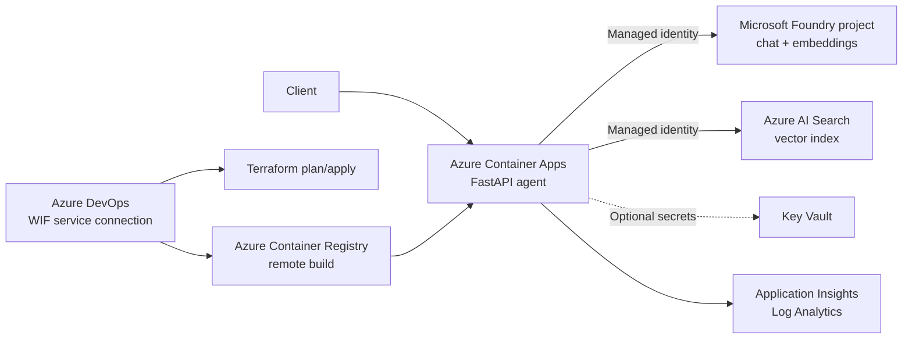

# Production-style Azure AI Agent POC


A practical, keyless Retrieval-Augmented Generation (RAG) platform built with
Microsoft Foundry, Azure AI Search, Container Apps, Terraform, and Azure DevOps.
It is intentionally small enough for a demo while preserving production
patterns: managed identity, Azure RBAC, immutable Terraform plans, deployment
approvals, bounded scaling, health probes, telemetry, and optional private
networking.


Suggested GitHub repository name: **`azure-ai-agent-poc`**

> This is a reference POC, not a turnkey production system. The default API is
> publicly reachable and unauthenticated so that the first demo is easy to run.
> Before real users or data are introduced, enable Entra API authentication and
> apply the hardening items in [Security](docs/security.md).

## What gets deployed



The agent retrieves relevant documents, sends only that context to the chat
model, returns source citations, and refuses unsupported answers. Retrieved
text is explicitly treated as untrusted input.

## MVP versus enterprise extensions

| Capability | MVP default | Optional enterprise extension |
|---|---|---|
| AI platform | New Foundry `AIServices` account and project | Model allowlists, evaluations, content-safety policy |
| Authentication to Azure | User-assigned managed identity; local keys disabled | Separate identities per tool and workload |
| API ingress | Public HTTPS demo endpoint | Entra JWT required, WAF, private/internal ingress |
| Service networking | Public endpoints with Entra/RBAC | VNet-integrated Container Apps and private endpoints |
| API gateway | None | APIM Standard v2/Premium when gateway policies justify cost |
| Search authorization | One shared POC index | Per-document security filters or separate indexes |
| Scale | Consumption, 0–2 replicas | Minimum replicas, zone-aware design, load tests |
| Delivery | Dev/prod parameters, plan artifact, approval environment | Separate plan/apply identities and subscriptions |
| Operations | Traces, dependency telemetry, 0.5 GB/day cap | SIEM, redaction policy, quality and cost SLOs |

Read [the architecture guide](docs/architecture.md) for trust boundaries and
the reasons behind these choices.

## Repository layout

```text
app/                    FastAPI RAG agent
data/                   Safe sample knowledge
docs/                   Architecture, security, cost, and article material
infra/
  bootstrap/            One-time remote-state storage
  environments/         Environment values
  modules/              AI, application, identity, network, observability
scripts/                Idempotent search-index loader
tests/                  API tests
azure-pipelines.yml     Validate → Plan → Apply → Build/Deploy/Test
```

## Prerequisites

- An Azure subscription with model quota in the target region
- Azure DevOps project and a Microsoft-hosted parallel job
- Terraform 1.8+ and Azure CLI for local deployment
- Permission to create resources and role assignments
- The Azure DevOps **Terraform** extension, which supplies
  `TerraformInstaller@1`

Model names, versions, and regional availability change. Check the Foundry
model catalog and update `infra/environments/dev.tfvars` before the first plan.

## Option A: deploy locally

### 1. Bootstrap remote state

```bash
az login
az account set --subscription "<subscription-id>"
terraform -chdir=infra/bootstrap init
terraform -chdir=infra/bootstrap apply
```

Copy the three outputs into a backend configuration or provide them as
`-backend-config` arguments.

### 2. Initialize and deploy infrastructure

```bash
terraform -chdir=infra init \
  -backend-config="resource_group_name=<state-rg>" \
  -backend-config="storage_account_name=<state-storage>" \
  -backend-config="container_name=tfstate" \
  -backend-config="key=ai-agent/dev.tfstate" \
  -backend-config="use_azuread_auth=true"

terraform -chdir=infra plan \
  -var-file=environments/dev.tfvars \
  -out=dev.tfplan
terraform -chdir=infra apply dev.tfplan
```

The deploying identity needs resource creation rights and permission to create
role assignments. For a POC, `Contributor` plus `Role Based Access Control
Administrator` at the intended scope is sufficient. Narrow this further for a
long-lived platform.

### 3. Build and deploy the application

```bash
RG=$(terraform -chdir=infra output -raw resource_group_name)
ACR=$(terraform -chdir=infra output -raw container_registry_name)
APP=$(terraform -chdir=infra output -raw container_app_name)

az acr build --registry "$ACR" --image ai-agent:local .
az containerapp update \
  --resource-group "$RG" \
  --name "$APP" \
  --image "$ACR.azurecr.io/ai-agent:local"
```

### 4. Load the sample search index

Role assignments can take several minutes to propagate.

```bash
export AZURE_AI_ENDPOINT=$(terraform -chdir=infra output -raw foundry_endpoint)
export AZURE_OPENAI_CHAT_DEPLOYMENT=$(terraform -chdir=infra output -raw chat_deployment_name)
export AZURE_OPENAI_EMBEDDING_DEPLOYMENT=$(terraform -chdir=infra output -raw embedding_deployment_name)
export AZURE_SEARCH_ENDPOINT=$(terraform -chdir=infra output -raw search_endpoint)
export AZURE_SEARCH_INDEX=$(terraform -chdir=infra output -raw search_index_name)

python -m pip install .
python scripts/index_documents.py
```

For the private profile, run this from a VNet-connected agent or development
host with private DNS resolution.

### 5. Test

```bash
API_URL=$(terraform -chdir=infra output -raw container_app_url)
curl "$API_URL/health"
curl -X POST "$API_URL/ask" \
  -H "Content-Type: application/json" \
  -d '{"question":"How should production workloads authenticate?"}'
```

## Option B: deploy with Azure DevOps

1. Create workload-identity-federated ARM service connections named
   `sc-ai-agent-dev` and `sc-ai-agent-prod`. The included script can create the
   two Entra identities, federated connections, and required Azure RBAC:

   ```bash
   az login --tenant "<tenant-id>"
   az extension add --name azure-devops

   ./scripts/create-azure-devops-wif-connections.sh \
     --organization "https://dev.azure.com/<organization>" \
     --project "<project-name>" \
     --subscription-id "<subscription-id>" \
     --state-resource-group "rg-aiagent-tfstate" \
     --state-storage-account "<bootstrap-output>" 
   ```

   The first run is preview-only. Review the subscription-level role scopes,
   then repeat with `--apply`. The script requires you to type the subscription
   name before making changes. It does not grant access to all pipelines. State
   storage validation uses Azure Resource Manager API `2025-01-01` directly to
   avoid an Azure CLI storage API-profile mismatch seen in some CLI releases.
2. Create variable groups `ai-agent-dev` and `ai-agent-prod` containing:
   `tfStateResourceGroup`, `tfStateStorageAccount`, and `tfStateContainer`.
3. Grant each pipeline permission to use its service connection and variable
   group.
4. Create Azure DevOps environments `ai-agent-dev` and `ai-agent-prod`. Add a
   manual approval check to production.
5. Review `infra/environments/prod.tfvars`; it enables the private-network
   profile but intentionally leaves API authentication off until you supply an
   Entra tenant and audience.
6. Run the pipeline with `apply=false` for a plan-only review. Re-run with
   `apply=true` to apply that run's immutable plan and deploy the image.

Pull requests only execute validation and plan. Apply is explicitly disabled
for PR builds. Workload identity federation avoids stored client secrets.

## Local development

```bash
python -m venv .venv
source .venv/bin/activate
pip install -e ".[dev]"
ruff check app scripts tests
pytest
uvicorn app.main:app --reload
```

`DefaultAzureCredential` uses your Azure CLI identity locally and the assigned
managed identity in Container Apps.

## Clean up

Destroy the workload first, then the state storage only after its state is no
longer needed:

```bash
terraform -chdir=infra destroy -var-file=environments/dev.tfvars
terraform -chdir=infra/bootstrap destroy
```

Key Vault purge protection intentionally prevents immediate permanent deletion.

## Publish to GitHub

From the extracted `azure-ai-agent-poc` directory:

```bash
git init -b main
git add .
git commit -m "Initial Azure AI agent POC"
git remote add origin https://github.com/<your-user>/azure-ai-agent-poc.git
git push -u origin main
```

Alternatively, with GitHub CLI:

```bash
git init -b main
git add .
git commit -m "Initial Azure AI agent POC"
gh repo create azure-ai-agent-poc --public --source=. --remote=origin --push
```

## Further reading

- [Architecture and data flow](docs/architecture.md)
- [Security controls and production gaps](docs/security.md)
- [Cost controls](docs/cost.md)
- [Deployment runbook](docs/deployment.md)
- [Architecture decisions](docs/decisions/adr-001-platform-shape.md)
- [Medium and LinkedIn material](docs/article-kit.md)
- [Official technical references](docs/references.md)
