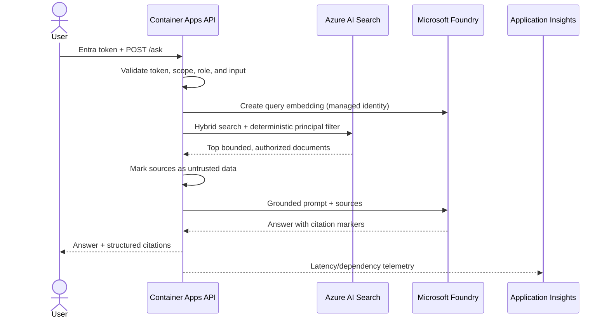
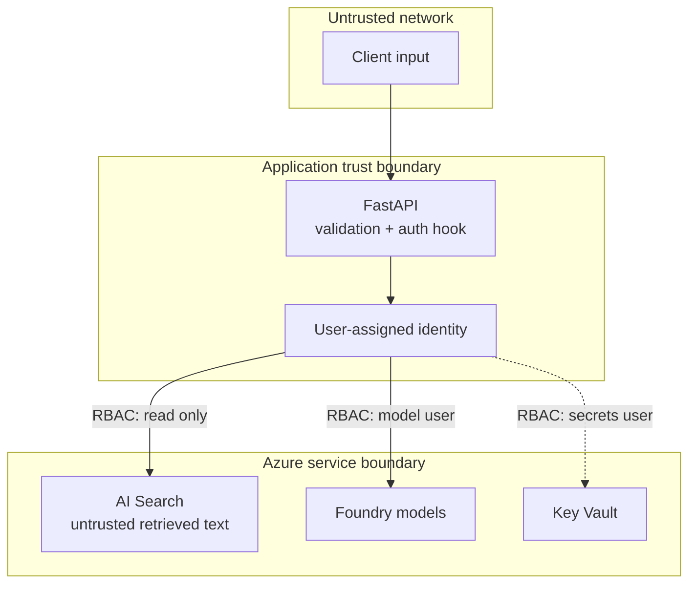
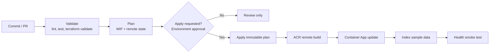

# Architecture

## Editable architecture package

- [Two-page Azure end-to-end architecture
  (`.drawio`)](diagrams/azure-ai-agent-end-to-end.drawio)
- [Connectivity, ports, identity, and trust-boundary
  matrix](diagrams/connectivity-and-ports.md)
- [Visio and diagrams.net build guide](diagrams/visio-build-guide.md)

The editable diagram uses the Microsoft Azure icon library and separates the
currently implemented POC from optional enterprise production extensions.

## Design goal

Demonstrate how an Azure AI prototype becomes a governed cloud workload without
turning a POC into a costly microservice platform. Expected scale is fewer than
1,000 users, a small document set, and a small engineering team.

## Runtime flow

The API does not expose arbitrary tools or write actions. That is deliberate:
adding an agent tool expands the identity's authority and requires its own
schema validation, allowlist, timeout, audit trail, and—when consequential—a
human approval step.

## Trust boundaries

The model is never an authorization decision point. Azure RBAC controls service
access. When Phase 2 document authorization is enabled, explicit public, user,
group, and role principals are applied as deterministic Search filters before
content reaches the model.

The default dev and production configurations co-locate the workload in West
Europe. This includes Container Apps, Container Registry, Key Vault, Microsoft
Foundry, Azure AI Search, Log Analytics, Application Insights, managed identity,
and optional networking resources. Fresh bootstrap deployments also default to
West Europe. Co-location keeps the runtime data path and private networking
design simple and avoids an unnecessary cross-region Search dependency. An
existing Terraform state account can remain in its original region because it
is a separate deployment-control resource and doesn't participate in application
inference or retrieval; move it only through a deliberate state migration.

Regional service support doesn't guarantee quota or capacity for a specific
subscription. Before deployment, verify both configured model deployments and
the selected Search tier in the target subscription. The pipeline then provides
the final capacity check by creating an immutable Terraform plan and applying it
only after approval.

## Deployment flow

The plan file is the artifact applied later in the same run. Production uses an
Azure DevOps environment approval and sequential locking.

## Profiles

### MVP

- Foundry, Search, and Key Vault have public endpoints.
- Local/key authentication is disabled for Foundry and Search.
- Azure RBAC and managed identity remain mandatory.
- Container Apps scales to zero.
- This is the recommended article/demo profile.

### Private POC

Set `enable_private_networking = true`:

- Container Apps environment joins a delegated subnet.
- Foundry, Search, and Key Vault public access is disabled.
- Private endpoints and required private DNS zones are created.
- Indexing must execute from a VNet-connected build agent.

This profile proves the network pattern. It does not include enterprise hub
connectivity, Azure Firewall egress inspection, custom DNS forwarders, or
private ACR; those depend on the organization's landing zone.

## Deliberately excluded from the MVP

- API Management: valuable for quotas, model routing, and policy enforcement,
  but a fixed gateway tier is difficult to justify for a small POC.
- Cosmos DB: no conversation persistence is required.
- Service Bus: the request flow is synchronous and short-lived.
- AKS: Container Apps provides the needed scale-to-zero and identity features.
- Agent write tools: the demo is read-only by design.
