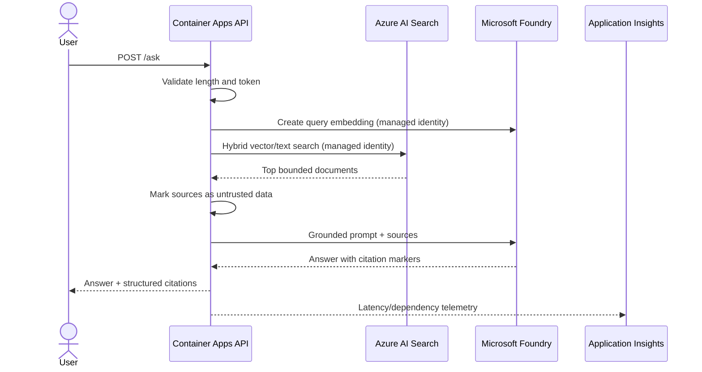
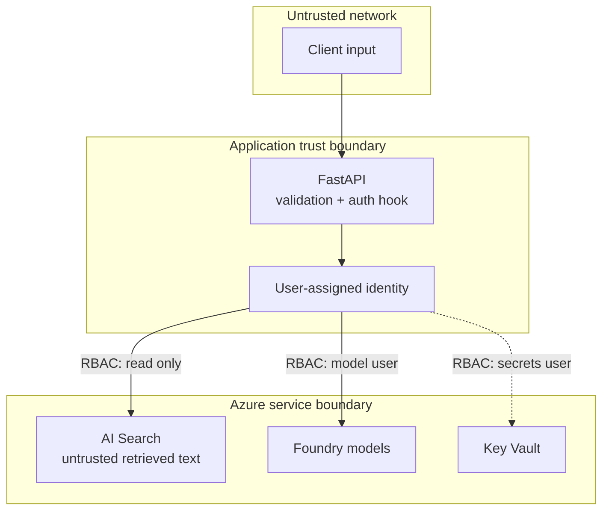
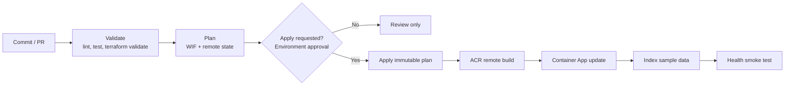

# Architecture

## Design goal

Demonstrate how an Azure AI prototype becomes a governed cloud workload without
turning a POC into a costly microservice platform. Expected scale is fewer than
1,000 users, a small document set, and a small engineering team.

## Runtime flow

The API does not expose arbitrary tools or write actions. That is deliberate:
adding an agent tool expands the identity's authority and requires its own
schema validation, allowlist, timeout, audit trail, and—when consequential—a
human approval step.

## Trust boundaries

The model is never an authorization decision point. Azure RBAC controls service
access; future document-level access must be applied as deterministic search
filters before content reaches the model.

## Deployment flow

The plan file is the artifact applied later in the same run. Production uses an
Azure DevOps environment approval and sequential locking.

## Profiles

### MVP

- Foundry, Search, and Key Vault have public endpoints.
- Local/key authentication is disabled for Foundry and Search.
- Azure RBAC and managed identity remain mandatory.
- Container Apps scales to zero.
- This is the recommended article/demo profile.

### Private POC

Set `enable_private_networking = true`:

- Container Apps environment joins a delegated subnet.
- Foundry, Search, and Key Vault public access is disabled.
- Private endpoints and required private DNS zones are created.
- Indexing must execute from a VNet-connected build agent.

This profile proves the network pattern. It does not include enterprise hub
connectivity, Azure Firewall egress inspection, custom DNS forwarders, or
private ACR; those depend on the organization's landing zone.

## Deliberately excluded from the MVP

- API Management: valuable for quotas, model routing, and policy enforcement,
  but a fixed gateway tier is difficult to justify for a small POC.
- Cosmos DB: no conversation persistence is required.
- Service Bus: the request flow is synchronous and short-lived.
- AKS: Container Apps provides the needed scale-to-zero and identity features.
- Agent write tools: the demo is read-only by design.

